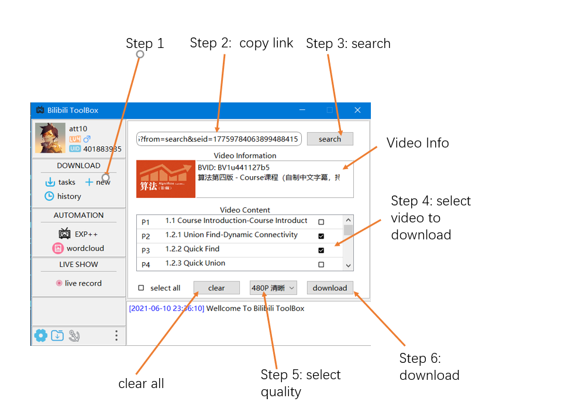

# Bilibili ToolBox

## 1. Intoduction
Our project is called "Bilibili Toolbox" on PC which provides extra support for Bilibili users. Today's Bilibili software doesn't provide some services like daily Automatically dropping coins, generating word cloud, multi task downloading videos and lively recording screen. We hope to provide this to users who are familiar with computer knowledge and have the needs in this respect. To achieve these capabilities, we did a lot of analysis on the Bilibili website and looked for specific ports to enable users to connect to Bilibili. 

## 2. Limitation

This project only support the full features on Windows10 platform and only windows10 deploy scripts and executable file is provided. This project can run on macOS and Linux OS, but its functionalities are not guaranteed. 

## 3. Environment 

```
Step 1: download full project code
Step 2: download python 3.8.10 and install
Step 3: install python 3.8.10 follow the python install guide
Step 4: run setup script
Step 5: use the bilibili toolbox for free
```

### 3.1 Python Installation Guide


### 3.2 Environment Setup Guide

### 3.2.1 Setup From Zero

```
1. Download Source Code 
git pull https://csgitlab.ucd.ie/2008jgroup13/bilibili-toolbox/ master

2. Install Python 3.8.10
see 3.1 Python Installation Guide

3. Run Setup Script
run the setup-windows.bat file in script

4. Use Bilibili ToolBox
run the executable file release/BilibiliToolBoxGUI/BilibiliToolBoxGUI.exe
```

### 3.2.2 Use provided executable release 

```
Download the package in the final release which is named v3.0.0
```

## 4. Usage

### 4.1 Login


### 4.2 Download

#### 4.2.1 New Task



#### 4.2.2 History


#### 4.2.3 Tasks


### 4.3 Automation

#### 4.3.1 Drop Coin and Sign in


#### 4.3.2 Wordcloud


### 4.4 Live Record

Recording function provides Bilibili Toolbox software with the function of recording live broadcasts from Bilibili. Users can record live broadcasts by inputting the RoomID numbers of anchors (also called “UP主” in Chinese) with the live broadcasts that they are interested in. 

When running the function, users are required to input the RoomID of anchors with live broadcasts that they want to record (Step 1) and the file name they want to save the video (Step 2). Press the “search” button to search the information about the live broadcast (Step 3). Then users need to choose the video quality (Step 4) and server (Step 5) for recording. And finally press the “record” button to record the live video (Step 6). The text box indicated by the blue arrow (step 7) will display the real-time bullet screen in the live broadcast room.


### 4.5 Setting

